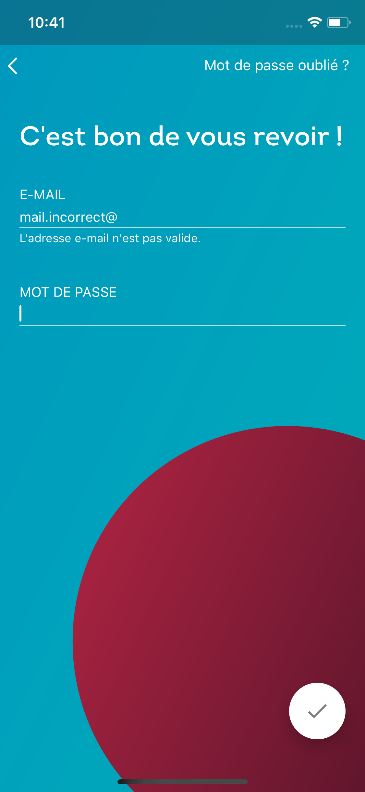
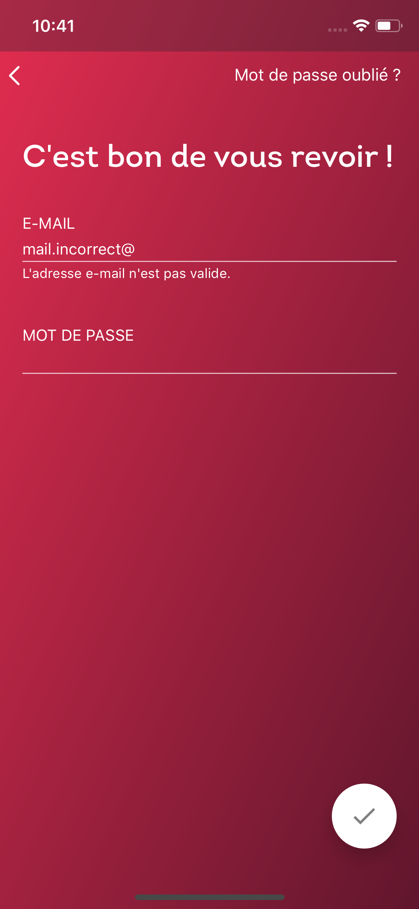

# LPC Ripple Animation View iOS

Ce repository correspond à la bibliothèque d'affichage de l'animation ripple (exemple: cas d'erreur d'un formulaire) de tous les projets du Pot Commun sur iOS.

## Intégration

Animation en avant (reveal)

```
	let ripple = LPCRipple(viewController: self, startFrame: submitButton.frame)
	ripple.play()
```

Animation en arrière (unreveal)

```
	ripple.remove()
```





*Screenshot de l'apperçu de la bibliothèque.*